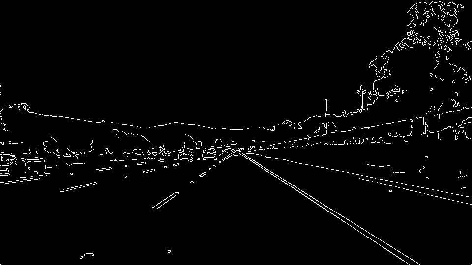
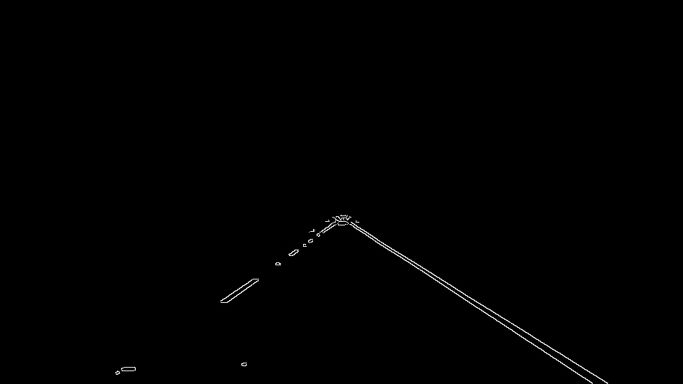
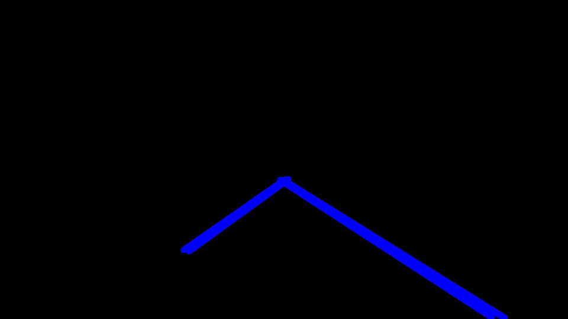

# **Finding Lane Lines on the Road**
Szabolcs Sergyan's project

## Pipeline of my solution

1. Convert the image from RGB to grayscale.
```
def convertRgbToGrayscale(image):
    return cv2.cvtColor(image, cv2.COLOR_RGB2GRAY)
```


2. Apply Gaussian smoothing with a kernel size of 5.
```
def filterGaussian(image, kernelSize):
    return cv2.GaussianBlur(src = image, ksize = (kernelSize, ) * 2, sigmaX = 0)
```


3. Detect edges using Canny edge detection where higher threshold is 100 and lower threshold is 50.
```
def detectEdges(image, lowThreshold, highThreshold):
    return cv2.Canny(image = image, threshold1 = lowThreshold, threshold2 = highThreshold)
```


4. Use a mask in order to focus on the relevant part of the image.
```
def mask(image, bottomX, middleY):
    mask = np.zeros_like(image)
    ignoreMaskColor = 255
    size = image.shape
    fromSide = size[1] * bottomX
    middleHeight = size[0] * (1 - middleY)
    vertices = np.array([[(fromSide, size[0] - 1), (size[1] / 2, middleHeight), (size[1] - 1 - fromSide, size[0] - 1)]], dtype = np.int32)
    cv2.fillPoly(mask, vertices, ignoreMaskColor)
    return cv2.bitwise_and(image, mask)
````
The mask was a lower triangle of the image.


5. Apply hough transform in order to specify lines. The applied thresholds were the following:
- rho = 1
- theta = pi / 180
- threshold = 75
- minLineLength = 50
- maxLineGap = 100
```
def hough(image, deltaRho, deltaTheta, counterThreshold, minLineLength, maxLineGap):
    size = image.shape
    lineImage = np.zeros(shape = (size[0], size[1], 3), dtype = np.uint8)
    lines = cv2.HoughLinesP(image = image, rho = deltaRho, theta = deltaTheta, threshold = counterThreshold, lines = None, minLineLength = minLineLength, maxLineGap = maxLineGap)
    return lines
```

In ideal case we should have only one lane line on the left and another one on the right. As you can see here we have more than two lines.

6. Separate left and right lanes. The slope of the lanes on one side should be between pi / 6 and pi / 3 and on the other side between 2pi / 3 and 5 pi / 6.

7. From the lines of one side that is selected which has the maximal length. From this line a lane line can be extrapolated.
```
def between(value, middle, radius) -> bool:
    return middle - radius < value < middle + radius

def sideLine(lines, expectedSlope, deltaSlope, imageSize, isLeft):
    lineImage = np.zeros(shape = imageSize, dtype = np.uint8)
    if lines.size != 0:
        corners = []
        middles = []
        maxLength = 0
        maxCoordinates = None
        for line in lines:
            for x1, y1, x2, y2 in line:
                phi = (y2 - y1) / (x2 - x1)
                if between(phi if not isLeft else -phi, expectedSlope, deltaSlope):
                    currentLength = (x1 - x2) ** 2 + (y1 - y2) ** 2
                    if (x1 - x2) ** 2 + (y1 - y2) ** 2 > maxLength:
                        maxLength = currentLength
                        maxCoordinates = (x1, y1, x2, y2)
        if maxCoordinates != None:
            bottom = np.int((maxCoordinates[0] - maxCoordinates[2]) / (maxCoordinates[1] - maxCoordinates[3]) * (imageSize[0] - 1 - maxCoordinates[3]) + maxCoordinates[2])
            height = 3 * imageSize[0] / 5
            center = np.int((maxCoordinates[0] - maxCoordinates[2]) / (maxCoordinates[1] - maxCoordinates[3]) * (height - maxCoordinates[3]) + maxCoordinates[2])
            cv2.line(img = lineImage, pt1 = (bottom, imageSize[0] - 1), pt2 = (center, np.int(height)), color = (255, 0, 0), thickness = 10)
    return lineImage
```

8. The main implementation using the above-mentioned functions is the following:
```
def processImage(image):
    grayScaleImage = convertRgbToGrayscale(image = image)
    blurredGrayScalImage = filterGaussian(image = grayScaleImage, kernelSize = 5)
    edges = detectEdges(image = blurredGrayScalImage, lowThreshold = 50, highThreshold = 100)
    maskedEdges = mask(image = edges, bottomX = 0.1,middleY = 0.45)
    lines = hough(image = maskedEdges, deltaRho = 1, deltaTheta = np.pi / 180, counterThreshold = 50, minLineLength = 50, maxLineGap = 100)
    rightLanes = sideLine(lines = lines, expectedSlope = np.pi / 4, deltaSlope = np.pi / 12, imageSize = image.shape, isLeft = False)
    leftLanes = sideLine(lines = lines, expectedSlope = np.pi / 4, deltaSlope = np.pi / 12, imageSize = image.shape, isLeft = True)
    bothSidesLanes = np.add(leftLanes, rightLanes)
    lanes = cv2.addWeighted(src1 = image, alpha = 0.8, src2 = bothSidesLanes, beta = 1, gamma = 0)
    return lanes
```

## Shortcoming

- The lane lines are not stable enough in two consecutive frames. It would be improved if the location of lanes on some previous frame were considered.
- My lane detection solution works on the challenging video as well, however if the visibiliy were much worse it would cause a more significant challenge.
- I focused on the lane lines on left and right side, but I did not take care lane segments. If that had been the project to identify segmented and solid lines, this solution would not work correctly.

## Possible improvements

- At edge detection the thresholds would be adaptive. As a first step we should investigate the distribution of grayscale values on the masked part of the image and based on this distribution the selection of thresholds would be developed.
- If we had information about the length of segmented lanes on a road the parameters of hough transform would be specified more accurately.